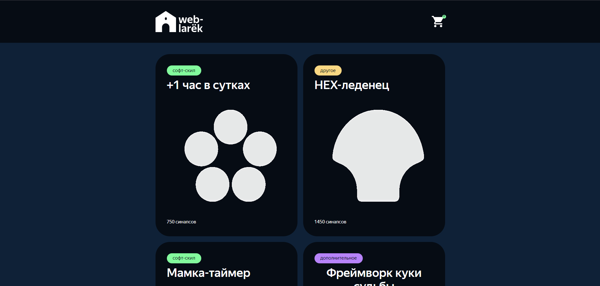

# Приложение "Веб-ларек"


Стек: HTML, SCSS, TS, Webpack

Структура проекта:

- src/ — исходные файлы проекта
- src/components/ — папка с JS компонентами
- src/components/base/ — папка с базовым кодом

Важные файлы:

- src/pages/index.html — HTML-файл главной страницы
- src/types/index.ts — файл с типами
- src/index.ts — точка входа приложения
- src/scss/styles.scss — корневой файл стилей
- src/utils/constants.ts — файл с константами
- src/utils/utils.ts — файл с утилитами

## Установка и запуск

Для установки и запуска проекта необходимо выполнить команды

```
npm install
npm run start
```

или

```
yarn
yarn start
```

## Сборка

```
npm run build
```

или

```
yarn build
```

## Данные и типы используемые в приложении


Карточка товара

```
interface IProductItem {
	id: string;
	description?: string;
	image: string;
	title: string;
	category: CategoryType;
	price: number;
	buttonDisable(state: boolean): void;
}
```

Тип для категории товара

```
export type CategoryType =
	| 'софт-скил'
	| 'другое'
	| 'дополнительное'
	| 'кнопка'
	| 'хард-скил';
```


Интерфейс для описания данных передаваемых в запросе на покупку

```
  interface IOrderRequest {
	payment: string;
	email: string;
	phone: string;
	address: string;
	total: number;
	items: string[];
}
```

Тип для описания выбора метода оплаты

```

type PaymentMethod = {
  payment: 'CASH' | 'CARD';
};
```

Тип для описания типа данных возвращающихся после успешного запроса на покупку

```
type ApiListResponse<Type> = {
    total: number,
    items: Type[]
};
```

Интерфейс для описания данных принимаемых в класс AppState(модель данныъ приложения)
```

interface IAppStateData {
	cards: IProductItem[];
	selectedCard: IProductItem;
}

```

Интерфейс апи для запросов на сервер

```
export interface IWebLarekApi {
	getProductLIst: () => Promise<IProductList>;
	getProductItem: (id: string) => Promise<IProductItem>;
	postOrder: (order: IOrderRequest) => Promise<IOrderResult>;
}
```

Интерфейс главной страницы

```

interface IPage {
	counter: number;
	catalog: HTMLElement[];
	locked: boolean;
}
```

Интерфейс корзины

```
interface IBasketView {
	title: HTMLElement;
	basketList: HTMLElement[];
	basketButton: HTMLButtonElement;
	totalPrice: HTMLElement;
}
```

Интерфейс элемента в корзине (товара)

```
interface IBasketItem {
	index: number;
	title: string;
	price: number;
}
```

Интерфейс базового модального окна

```
export interface IModalData {
	content: HTMLElement;
}
```

Интерфейс базовой формы

```

interface IFormState {
	valid: boolean;
	errors: string[];
}
```
Интерфейс формы выбора метода оплаты и ввода адреса доставки

```

interface IOrderForm {
	address?: string;
	email?: string;
	phone?: string;
}
```

Интерфейс расширяет интерфейс IOrderForm и добавляет массив строк items,\
 используется для описания заказа, включающего все поля формы заказа, а также список товаров.

```

interface IOrder extends IOrderForm {
	items: string[];
}
```

Тип представляет собой частичный объект, где ключи - это поля интерфейса IOrder, а значения - строки, представляющие ошибки для соответствующих полей.
Это позволяет удобно описывать ошибки валидации формы, где для каждого поля может быть указана соответствующая ошибка.

``` 

export type FormErrors = Partial<Record<keyof IOrder, string>>;

```
Интерфейс для описания состояние формы

```

export interface IFormState {
	valid: boolean;
	errors: string[];
}
```

Интерфейс формы выбора способа оплаты

```
 interface IPaymentChangedEvent {
	method: string;
}
```

Интерфейс для передаваемого обработчика событий
```
interface IActions {
	onClick: (event: MouseEvent) => void;
}
```
## Архитектура приложения

Код приложения разделяется на слои согласно MVP парадигме:

- слой представления отвечает за отображение данных на странице
- слой данных отвечает за хранение и изменение данных
- презентер, отвечает за связь представления и данных

## Базовый код

#### Класс Api

Содержит в себе базовую логику отправки зарпосов.

Содержит методы:

- 'get' - выполняет GET запрос на переданный в параметрах эндпоинт и возвращает промис с объектом, которым ответил сервер
- 'post' в теле принимает данные в виде объекта в формате JSON в теле запроса и отправляет эти данные на эндпоинт переданный в качестве параметра при вызове метода.

#### Класс EventEmitter

Брокер событий позволяет отправлять события и подписываться на события, происходящие в системе. Используется в презентере для обработки событий и в слоях приложения для генерации событий.
Основные методы, реализуемые описанным интерфейсом 'IEvents':

- 'on' - подписка на событие
- 'off - отписка от события
- 'emit' - инициализация события
- 'onAll' - слушает все события
- 'offAll' - сбрасывает все события
- 'trigger' - возвращает функцию, при вызове которой инициализируется содержимое передаваемое в параметрах собыития

### Слой данных

## абстрактный класс Model

Использует абстрактный тип.
В конструктор принимает атрибут data абстрактного типа\
и объект типа IEvents.

методы:
- emitChanges - позволяет сообщить всем что модель изменилась

## класс AppState
Расширяет абстрактный класс Model и использует данные типа\ IAppStateData, позволяет нам хранить и обрабатывать все данные используемые в приложении.\

методы: 
- сеттер setCards - позволяет установить каталог товаров
- геттер getCards - возвращает ранее сохраненный каталог
- addCardToBasket - добавляет товар в корзину
- removeCardFromBasket - удаляет товар из корзины
- clearBasket - очищает корзину
- getBasket - возвращает массив товаров в корзине
- setOrderField устанавливает адрес заказа и вызывает метод для валидации
- setContactsField устанавливает email и телефон, а также вызывает метод для валидации
- validateOrder - метод для валидации формы OrderForm
- validateContacts - метод для валидации формы ContactsForm

### Слой отображения
Позволет отображать элементы и окна страницы


## Абстрактный класс Component
 Использует бастрактный тип данных и позволяет отрисовывать компоненты страницы
 Принимает в конструктор conteiner: HTMLElement

 методы:
 - protected setText - позволяет установить текстовый контент
 - setDisable - опзволяет добавлять и снимать атрибут disable
 - protected setHidden - позволяет скрыть элемент
 - protected setVisible - позволяет показать элемент
 - protected setImage - устанавливает значение атрибута src
 - render - возвращает переданый в класс контейнер

 ## Класс Page

 Расширяет абстрактный класс Component с типом IPage
 используется для отрисовки элементов главной страницы.

 В конструктор принимает container и объект типа IEvents

 в конструкторе инициализируются HTML элементы:
 - обёртки страницы
 - корзины( также на неё вешается слушатель клика)
 - счетчика товаров 
 - списка товаров

 методы: 
 - сеттер counter - устанавливает значение счетчика
 - сеттер catalog - устанавливает элементы в массив товаров
 - сеттер locked - позволяет изменять состояние прокрутки страницы 

## Класс Busket 
класс для отрисовки корзины расширяет абстрактный класс Component с типом данных IBusketView

принимает в конструктор container и необязательный обаботчик actions

в контейнере устанавливает значения списка товаров, общей стоимости, кнопки корзины и вешает на неё слушатель клика.

методы: 
- сеттер items - добавляет товары в список товаров
- сеттер total - устанавливает общую стоимость товаров в корзине

## Класс BasektItem 
Класс позволяет отрисовывать товар внутри корзины. 
Расширяет абстрактный класс Component с типом IBAsketItem

В конструктор принимает container и необязательный объект actions типа IActions.

 в конструкторе инициализируются HTML элементы:

- порядковый номер товара (индекс)
- заголовок
- цена
- кнопка удаления (также вешается слушатель клика)

методы:
- сеттер index - устанавливает значение порядкового номера товара
- сеттер title - устанавливает заголовок
- сеттер price - устанавливает цену

## Класс ProductListItem 
Отрисовывает элемент списка товаров.
Расширяет абстрактный класс Component с типом данных IProductItem

принимает в конструктор blockName(используется для формирования селекторов при поиске HTML элементов), conteiner и необязательный объект actions типа IActions.

в конструкторе иницализируются HTML элементы:
 - категория товара
 - заголовок
 - изображение
 - цена

методы:
- clickHandler - устанавливает слушатель на контейнер элемента
- сеттер title - устанавливает заголовое
- сеттер image - устанавливает изображение
- сеттер category - устанавливает значение и цвет категории товара
- сеттер price - устанавливает цену товара

## класс ProductPreview

Позволяет отрисовать элемент открытой карточки товара с подробной информацией. Расширяет класс ProductListItem. 

Принимает в конструктор blockName, container и необязательный объект actions типа IActions

в конструкторе иницализируются HTML элементы:

- подробное описание товара
- кнопка добавления в корзину 

методы: 
- сеттер description - устанавливает подробное описание
- buttonDisable - позволяет переключать состояние кнопки добавления в корзину (активна/не активна)
- clickHandler - устанавливает слушатель клика на кнопку добавления в корзину

## Класс Modal 
Базовый класс модального окна. Позволяет отрисовывать все модальные окна на странице.

Расширяет абстрактный класс Component с типом IModalData.

В конструктор принимает container и объект events типа IEvets.

В конструкторе инициализируются HTML элементы: 
- кнопка закрытия модального окна 
- контент модального окна (в это свойство попадут формы и модальное окно успешного заказа)
- также вешаются слушатели клика на кнопку закрытия, контейнер и контент 

методы:

- сеттер content - устанавливает контент модального окна
- openModal - открывает модальное окно
- closeModal - закрывает модальное окно
- render - возвращае HTML элемент модального окна

## Класс SuccessModal
Отображает модальное окно успешного заказа, расширяет абстрактный класс Component с типом ISuccesModal.

Принимает в конструктор containter и объект типа IEvents

В конструкторе инициализируются HTML элементы:

- заголовок,
- описание полной стоимости товара
- кнопка, возвращающая на главную страницу

методы:
- сеттер description - устанавливает значение поля description 
- handleSuccesSubmit - генерирует событие закрытия модального окна

## Класс Form 
Использует данные абстактного типа и расширяет абстрактный класс Component с типом IFormState

Принимает в конструктор container и объект типа IEvents

В конструкторе инициализируются HTML элементы:

- кнопка собмита формы
- элемент ошибок форм

Также вешаются слушатели клика на контейнер и кнопку сабмита и генерируется событие modal:close

методы: 
- onInputChange - генерирует событие при вводе в инпут
- сеттер valid - устанавливает состояние кнопки в зависимости от переданого булевого значниея
- сеттер errors - устанавливает текстовый контент полей ошибок
- render - возвращает текущий HTML элемент контейнеа
- handleSubmit - обрабатывает событие ввода
- clearForm - очищает поля формы и ошибок

## Класс FormOrder
Позволяет отрисовывать валидировать и сабмитить форму выбора способа оплаты и ввода адреса.
Расширяет класс Form с типом IOrderRequest

В конструктор  принимает container и объект типа IEvents

В конструкторе инициализируются HTML элементы:
- поле ввода адреса
- кнопка выбора способа оплаты "cash"
- кнопка выбора способа оплаты "online"
- вызывается метод setAddEventListeners

методы:
- setAddEventListeners - вешает слушательввода в поле ввода, слушатели клика на кнопки выобра способа оплаты
- handleAddewssInput - устанавливает значение данных в поле ввода адреса и вызывает родительский метод onInputChange 
- handleCashPayment - используется для выбора способа наличными
- handleOnlinePayment - используется для выбора оплаты онлайн
- handlePayment - общий обработчик для handleCashpayment и handleOnlinePayment
- clearForm - переопределение родительского мтоеда clearForm, позволяет очищать поле ввода и выбранный метод оплаты


## Класс ContactsForm
Позволяет отрисовывать валидировать и сабмитить форму отправки контактных данных.
Расширяет класс Form с типом IOrderRequest

В конструктор принимает container и объект типа IEvents

В конструкторе инициализируются HTML элементы:
- поле ввода email
- поле ввода телефона
- вызывается функция setAddEventListeners

методы:
- setAddEventListeners вешает слушатели вводп на поля ввода
- handleSubmit - обрабатывает событие отправки формы
- handleEmailInput - обрабатывает ввод данныхх в поле ввода email
- handlePhoneInput - обрабатывает ввод данных в поле ввода телефона


### Слой коммуникации

## класс ApiWebLarekModel 
Имплементирует интерфейс IWebLarekApi и расширяет класс Api

Принимает в конструктор cdn (для конструирования полных путей изображений), baseUrl (базовый путь для отправки запросов) и необязательное поле options (опций)

методы: 
- getProductList - возвращает список товаров
- getProductItem - возвращает один товар
- postOrder - отправляет данные типа IOrderRequest 


## Взаимодействие компонентов
Код, описывающий взаимодействие представления и данных находится в файле index.ts и выполняет функцию презентера.\

Взаимодействие происходить за счет событий генерируемыз  с помощью брокера событий и обработчиков этих событий, описанных в index.ts.\
Сначала мы создаем экземпляры всех нужных классов, а затем настаиваем  обработку событий.

*Список событий которые могут генерироваться:*\

- `productList:changed` - изменение списка товаров
- `product:select` - выбор товара
- `product:added` - добавление товара в корзину
- `basketItem:remove` - изменение товаров в корзине
- `basket:open` - открытие корзины
- `formErrors:change'` - изменение окрытой карточки товара
- `/^order\..*:change/` - регулярное выражение для всех изменений полей заказа
`/^contacts\..*:change/` - регулярное выражение для всех изменений полей контактов
- `paymentCash:changed` - изменение способа оплаты "cash"
- `paymentOnline:changed` - изменение способа оплаты "online"
- `order:open` - открытие формы order
- `orderForm:submit` - сабмит формы order
- `contactsForm:submit` - сабмит формы ввода контактных данных
- `modal:open` - открытие модального окна
- `modal:close` - закрытие модального окна
- `modalSuccess` закрытие модального окна успешного заказа

